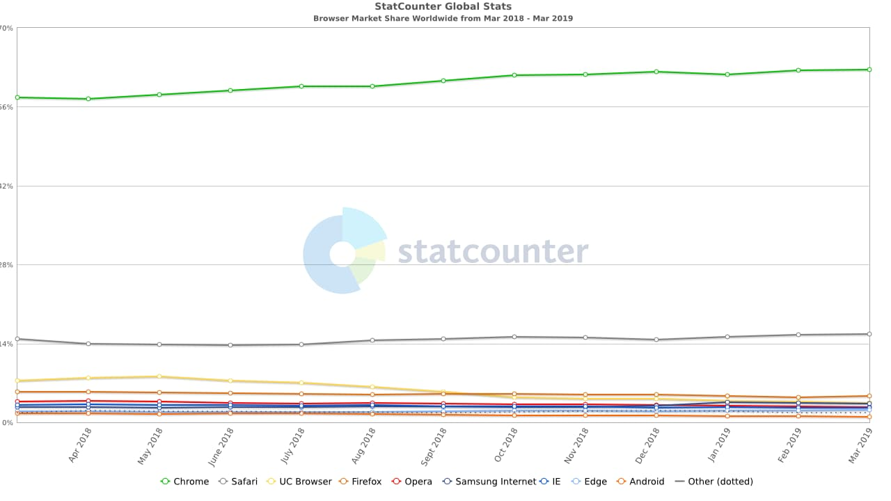
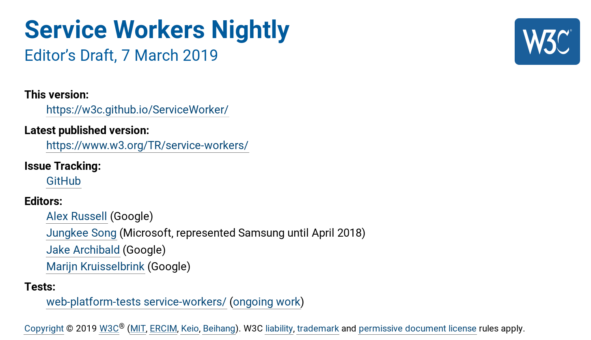

A few days ago, Microsoft released the first version of their new browser, Microsoft Edge. That name might sound familiar if you're a Windows 10 user, since it's also the name of their existing browser. So why the re-release?

Microsoft is releasing this new and improved Edge to hopefully try and shake the stigma that Microsoft browsers are horribly outdated and quirky. The solution? They're ditching the EdgeHTML rendering engine and the Chakra Javascript engine. Instead they will be using Chromium as the base for the new browser.

This is huge news. For years Google and Microsoft have been browser rivals, ever since Chrome launched back in 2008. Admittedly, the last few years haven't been good for any browser vendor other than Google. Take a look at the market share for browsers in 2018-2019

Chrome's market share is enormous. In fact, Chrome has double the market share of all the other browsers combined.

It makes sense why Microsoft would ditch their browser tech and just switch to Chromium. Edge only has around 2% of the market share, it's actually being beaten by IE which had it's last major release in 2013. Eventually Microsoft will release the new Edge with a Windows 10 update, which should give Chrome around about a 2.1% bump in market share.

Why is this a bad thing? After all, developers have hated IE for years. Trying to develop for IE sucks, especially if you need to support versions of IE older than 11. Features that we're used to in 2019 are either missing or poorly supported in old versions of IE. Take flexbox as an example, one my favourite features. Large portions of this site use flexbox, but IE10 and below either don't support it, or feature an old version of flexbox that doesn't work like our modern flexbox.

From a developer's point of view, this is fantastic. Edge will finally become an evergreen browser, meaning I should only have to worry about the last 2 versions or so, rather than supporting browsers from 5+ years ago. The future seems great, we only have to target 3 browser engines, Blink, Webkit and Gecko. And these browser engines are pretty similar anyway, Blink and Webkit are almost the same. For Gecko, compatibility with Webkit is at an all time high. We may never have to cross browser test ever again!

While this seems like a great future be in, this is terrible for the open web. The amazing thing about the web is that it isn't controlled by a single person or entity. Yes we have organisations like W3C and ECMA who help to standardise everything. But these organisations are a collaboration between different browser vendors and companies.

Microsoft switching Edge's browser engine from EdgeHTML to Chromium means we lose diversity on the web. We've had this happen before in the 90s - early 2000s with Microsoft. They managed to gain a sizeable chunk of the web browser market share by bundling IE with Windows. This got so out of hand that [Microsoft was taken to court by the US Government](https://en.wikipedia.org/wiki/United_States_v._Microsoft_Corp.) over this. As a result of this browser monopoly, Microsoft could do whatever they wanted with HTML, CSS and Javascript. One example is ActiveX. This was a proprietary plugin system that was designed for IE. If your site used ActiveX, it wouldn't work on non-Windows devices and would suffer on browsers other than IE.

At one point in the early 2000s, IE had over 90% market share. These early versions of IE didn't have very good standards support, which explains the issues that we all face with IE. But since IE was the most used browser in the world by far, it meant that developers had to build their sites to support IE's in-compliant rendering engine, hurting other browsers.

We may be entering into a similar situation in the next few years. Only with Google instead of Microsoft. Google already operate the 2 biggest websites on the internet and have the world's most popular browser. They have used this position to push new technologies such as the service worker and PWA. While the service worker and PWAs are interesting new tech, their adoption was largely driven by Chrome. Just take a look at which company was largely responsible for the [service worker spec](https://w3c.github.io/ServiceWorker/)

Microsoft switching to Chromium for their browser may seem like a great idea if you build websites for a living. However we will see less innovation that benefits the consumer and more that will benefit Google.

We've already seen this with AMP and AMP for email. Projects that are supposedly separate from Google (look it's even got it's own [Github org](https://github.com/ampproject)!). However Google has rewarded sites adopting their AMP format by placing news articles using AMP higher up in the results and marking them with a lightning bolt icon.

We can only expect to see more of this as Chrome's market share grows